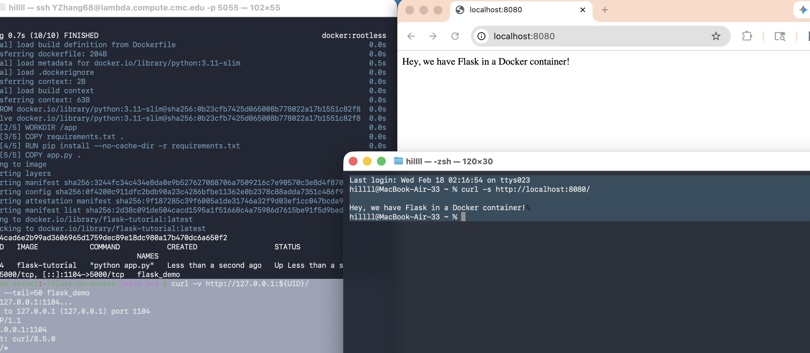

# Dockerized Flask Web App

A minimal Flask application containerized with Docker. Built by following the archived Runnable.com tutorial (Wayback Machine) and adapted for the lambda server by mapping the container’s port 5000 to a user-specific host port (`$UID`) to avoid conflicts.

## Run (on lambda)
```bash
docker build -t flask-tutorial .
docker rm -f flask_demo 2>/dev/null || true
docker run -d --name flask_demo -p ${UID}:5000 flask-tutorial
curl http://127.0.0.1:${UID}/
```

## Screenshot

